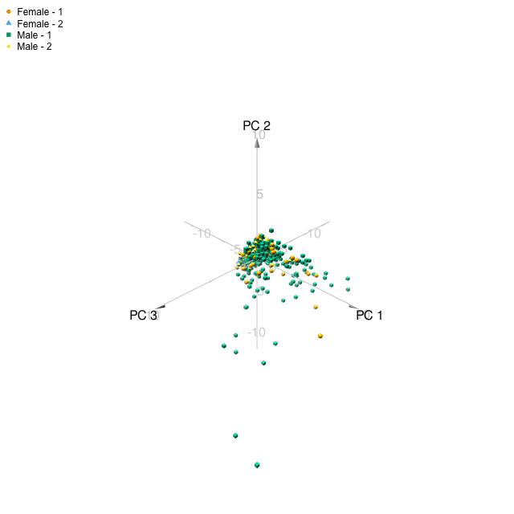

```{r setup, include=FALSE}
#chunk options
knitr::opts_chunk$set(echo = TRUE, 
                      error = FALSE, 
                      warning = FALSE, 
                      message = FALSE, 
                      fig.align = "center",
                      fig.width = 6, 
                      fig.height = 6)

# PACKAGES
## Tidy code
library(dplyr)

## Plot
library(ggplot2)
library(plotly)
library(FactoMineR)
library(factoextra)
library(corrplot)
library(patchwork)
```

# Información

El código y los archivos orginales de esta PEC, así como los informes en formato HTML pueden consultarse en el siguiente repositorio de [GitHub](https://github.com/amitjavilaventura/MultivariateAnalysis_PACs/tree/main/PAC1).

# Ejercicios

## Ejercicio 1 

**En un estudio sobre una enfermedad del hígado se recogieron datos de 583 pacientes del departamento de digestivo de un hospital. De ellos, 416 experimentan una afección del hígado y 167 tienen otros problemas pero no se ven afectados por dicha afección. El archivo `dataset.csv` contiene un conjunto de variables que se consideran “marcadores” de dicha enfermedad, además del género de los pacientes. Las variables registradas son:**

* **Age**: Edad del paciente
* **Gender**: Género del paciente
* **TB**: Bilirubina total
* **DB**: Bilirubina directa
* **Alkphos**: Fosfatasa alcalina
* **Sgpt**: Alamina Aminotransferasa
* **Sgot**: Aspartato Aminotransferasa
* **TP**: Proteínas totales
* **ALB**: Albúmina
* **A/G**: Ratio entre Albúmina y Globulina
* **Selector**: campo utilizado para romper los datos en dos grupos etiquetados 1 (*liver*) o 2 (*control*) por un grupo de expertos.

```{r read.data, results=FALSE}
data <- read.csv("dataset.csv") %>% dplyr::mutate(Selector = factor(Selector))
head(data)
```

### 1.1. Exploración de los datos {.tabset}

#### A)

**Realizar un resumen numérico y gráfico de los datos. Observar si hay valores faltantes y tenerlo en cuenta en el análisis.**

La manera más fácil de realizar un resumen numérico es usar la función `summary()`.

```{r 1a_num}
summary(data)
```


El resumen numérico nos puede dar varias informaciones, donde tenemos que la edad de los pacientes oscila entre 4 y 90 años, siendo la media y mediana muy similares (44.75 y 45), entre otras variables.

Buscando si hay valors faltantes (indicados como `NA`), se puede observar fácilmente que en el *ratio de albúmina y globulina* (variable **A.G**), hay un total de 4 valores que no están presentes. 

Para proceder con el análisis, dado que el número de valores *NA* és muy peqeño y solo afecta a una variable, podríamos usar el método de *complete-case analysis* usando solo los casos que tengan todas las variables completas o el método de *available-case analysis*. Debido a su mayor senzillez, vamos a proceder con el filtraje de los casos incompletos, quedandonos con esos que tengan información para todas las variables.

```{r filter.data,  results=FALSE}
data_filt <- data[which(complete.cases(data)),]
summary(data_filt)
```

Para hacer el resumen gráfico de las variables, podemos usar la función `plot()`, que nos dibujará una serie gráficos de dispersión relacionando las variables una contra una. 

```{r 1a_graph, fig.height=10, fig.width=10, fig.cap="Figura 1.1. Gráfico de dispersión que compara todas las variables (por pares) de nuestro set de datos. Los datos usados para este gráfico incluyen los casos incompletos y todas las variables, sean numéricas o no."} 
plot(data, main = "Scatterplot comparing all the variables one-vs-one")
```

A simple vista, las variables indicativas de la bilirubina directa y la bilirubina total (**DB** y **TB**, respectivamente) parecen tener una correlación bastante buena, así como las variables **TP** y **ALB** o **ALB** y **A/G**.

<br><br><br>

#### B)

**Estudiar la relación entre las variables numéricas, especialmente entre la bilirubina total y la directa. ¿Están correlacionadas?**

Para hacerlo sencillo, vamos a crear otro set de datos a partir de los datos filtrados (casos completos) con solo las variables numéricas (todas menos *Gender* y *Selector*)

```{r data_num, results=FALSE}
data_num <- data_filt %>% dplyr::select(everything(), -Gender, -Selector)
```

En el resumen gráfico del apartado anterior, a simple vista parece que la bilirubina total (**TB**) y la directa (**DB**) tienen una buena correlación.

Seguidamente vamos a comprobar la correlación entre variables usando la función `cor()` y a dibujar un gráfico de correlación con la función `corrplot()`.

```{r 1b_cor, fig.cap="Figura 1.2. Correlaciones entre las distintas variables. A más intensidad de color, más correlación, ya sea positiva (azul) o negativa (rojo). Para hacer este gráfico solo se han usado las variables numéricas y los casos completos."}
corrplot::corrplot(corr = cor(data_num), type = "lower", 
                   number.digits = 2, method = "color", 
                   addgrid.col = "gray50", addCoef.col = "black",
                   title = "Correlation plot showing the correlation between each pair of variables")
```

En el gráfico anterior, donde a más intensidad de color más correlación, vemos que, en general, la correlación entre las distintas variables es pequeña (coeficiente de correlación de *Pearson* de menos de 0.3 en valor absoluto). Sin embargo, hay cuatro pares de variables que sí que tienen una alta correlación, siendo la bilirubina total i la bilirubina directa las variables más correlacionadas (*Pearson* = 0.87):

* **DB** vs **TB**: *Pearson* = 0.87
* **Sgot** vs **Sgpt**: *Pearson* = 0.79
* **ABL** vs **TP**: *Pearson* = 0.78
* **A.G** vs **ALB**: *Pearson* = 0.69

Mirando estos números (*figura 1.2*), además del gráfico de dispersión (*figura 1.1*), podemos decir que la bilirubina total y la directa están altamente correlacionadas.

<br><br><br>

#### C)

**Hacer un gráfico multivariante de las correlaciones dos a dos.**

*Mirar apartado anterior*

<br><br><br>

#### D)

**Obtener una lista de las correlaciones dos a dos, ordenadas de mayor a menor.**

En la *Tabla 1.1* se muestran las correlaciones dos a dos, ordenadas de mayor a menor valor de *Pearson* en valor absoluto. Por razones de espacio, la *Tabla 1.1* se encuentra cortada a 10 entradas y la lista completa puede verse en la *Tabla S1.1* del material suplementario.

```{r 1d}
cor_list_1d <- cor(data_num) %>% 
  reshape2::melt() %>%
  dplyr::mutate(abs_pearson = sqrt(value^2)) %>%
  dplyr::arrange(desc(abs_pearson)) %>%
  magrittr::set_colnames(c("Variable 1", "Variable 2", "Pearson's correlation", "Absolute Pearson's"))

cor_list_1d %>% head(10) %>% knitr::kable(align = "c", caption = "Tabla 1.1. Lista de correlaciones dos a dos, ordenadas de mayor a menor correlación (en valor absoluto). Los valores de 1, indicando que una variable se enfrenta a ella misma, son mantenidos. Solo se muestran las 10 primeras entradas. La lista con todos los valores se puede encontrar en el material suplementario (Tabla S1.1).")
```


<br><br><br>

#### E)

**Repetir el punto anterior considerando las correlaciones parciales entre pares de variables cuando se fijan todas las demás. ¿Se ven afectadas vuestras conclusiones?**

Para calcular las correlaciones parciales, usaremos la función `pcor()` del paquete `ppcor()`. 

Primeramente haremos un gráfico de correlación como el de la *Figura 1.2*, con tal de observar las diferencias. Este gráfico podrá ser observado en la *Figura S1.1* en el material suplementario.

```{r 1.e.parcor}
par_cor_1e <- ppcor::pcor(data_num)
```

Viendo la *Figura S1.1*, se ve claramente que las correlaciones parciales cambian comparadas con las correlaciones obtenidas en la *Fig. 1.2*. Por ejemplo vemos como la correlación entre la bilirubina total (**TB**) y la directa (**DB**) disminuye ligeramente, mientras que las correlaciones parciales **ALB** vs **TP** (*Pearson's* = 0.82), **ALB** vs **A.G** (*Pearson's* = 0.90), y **TP** vs **A.G** (*Pearson's* = -0.69), augmentan (en valor absoluto) mucho comparadas con las correlaciones anteriores. 

Igual que en el apartado *d*, la lista completa de las correlaciones parciales se puede observar en la *Tabla S1.2* en el material suplementario mientras que la *Tabla 1.2* solo muestra las diez primeras entradas.

```{r 1.e}
par_cor_1e_list <- par_cor_1e$estimate %>% 
  reshape2::melt() %>%
  dplyr::mutate(abs_pearson = sqrt(value^2)) %>%
  dplyr::arrange(desc(abs_pearson)) %>%
  magrittr::set_colnames(c("Variable 1", "Variable 2", "Pearson's correlation", "Absolute Pearson's"))

par_cor_1e_list %>% head(10) %>% knitr::kable(align = "c", caption = "Tabla 1.2. Lista de correlaciones parciales dos a dos, ordenadas de mayor a menor correlación (en valor absoluto). Los valores de 1, indicando que una variable se enfrenta a ella misma, son mantenidos. Solo se muestran las 10 primeras entradas. La lista con todos los valores se puede encontrar en el material suplementario (Tabla S1.2).")

```


<br><br><br>

#### F)

**Calcular el vector de medias, la matriz de covarianzas y la matriz de correlaciones de las variables respuesta numéricas conjuntamente pero por separado para los dos grupos (niveles del factor _Selector_ sin tener en cuenta el género).**

Primero separamos los datos según el valor en la variable *Selector* (1 o 2). 

```{r 1f, results=FALSE}
data_num_selector1 <- data_filt %>% dplyr::filter(Selector == 1) %>% dplyr::select(everything(), -Gender, -Selector)
data_num_selector2 <- data_filt %>% dplyr::filter(Selector == 2) %>% dplyr::select(everything(), -Gender, -Selector)


mean_vect_selector1 <- colMeans(data_num_selector1)
mean_vect_selector2 <- colMeans(data_num_selector2)

cov_mat_selector1 <- cov(data_num_selector1)
cov_mat_selector2 <- cov(data_num_selector2)

corr_mat_selector1 <- cor(data_num_selector1)
corr_mat_selector2 <- cor(data_num_selector2)
```

Después de haber separado los datos, calculamos los vectores de medias con `colMeans()`, la matriz de covarianzas con `cov()` o la matriz de correlaciones con `cor()`:
  
**Vector de medias:**

* *Selector* == 1 ("Liver"):

`r mean_vect_selector1`

* *Selector* == 2 ("Control"):

`r mean_vect_selector2`

**Matriz de covarianzas:**

* *Selector* == 1 ("Liver"):

`r cov_mat_selector1`

* *Selector* == 2 ("Control"):

`r cov_mat_selector2`

**Matriz de correlaciones:**

* *Selector* == 1 ("Liver"):

`r corr_mat_selector1`

* *Selector* == 2 ("Control"):

`r corr_mat_selector2`
  
  
<br><br><br>

#### G)

**Calcular la varianza generalizada, la varianza total y el coeficiente de dependencia global $\eta^2 = 1−|R|$ para cada grupo por separado.**

**Varianza generalizada**: se defene como el determinante de la matriz de varianzas. Así pues, con la función `det()` y la función `var()` vamos a calcular la varianza generalizada (ex. `det(var(data))`).

```{r 1g1, results=FALSE}
var_g_total     <- det(var(data_num))
var_g_selector1 <- det(var(data_num_selector1))
var_g_selector2 <- det(var(data_num_selector2))
```

La varianza generalizada del total de los datos es `r var_g_total`, mientras que para los datos etiquetados como `Selector == 1` es `r var_g_selector1` y para los datos etiquetados con `Selector == 2` es `r var_g_selector2`.


**Varianza total**: se define como la suma de las varianzas de cada variable o como la traza de la matriz de varianzas y covarianzas. Como las varianzas son la diagonal de la matriz de varianzas-covarianzas, con la suma de la diagonal vamos a poder calcular la varianza total.

```{r 1g2}
vt_global    <- sum(diag(var(data_num)))
vt_selector1 <- sum(diag(var(data_num_selector1)))
vt_selector2 <- sum(diag(var(data_num_selector2)))
```

La varianza total del total de los datos es `r vt_global`, mientras que para los datos etiquetados como `Selector == 1` es `r vt_selector1` y para los datos etiquetados con `Selector == 2` es `r vt_selector2`.


**Coeficiente de dependencia global** o **$\eta^2 = 1−|R|$**: para calcular el coeficiente de dependencia global tenemos que calcular el determinante $||$ de la matriz de correlaciones $R$ ($|R|$) y restarlo de 1.

```{r 1g3}
coef_dep           <- 1-det(cor(data_num))
coef_dep_selector1 <- 1-det(cor(data_num_selector1))
coef_dep_selector2 <- 1-det(cor(data_num_selector2))
```

El coeficiente de dependencia del total de los datos es `r coef_dep`, mientras que para los datos etiquetados como `Selector == 1` es `r coef_dep_selector1` y para los datos etiquetados con `Selector == 2` es `r coef_dep_selector2`.


<br><br><br>


### 1.2. Visualización de los datos en dimensión reducida  {.tabset}

#### A)

**Realizar un análisis de componentes principales y estudiar la calidad de la representación por diversos criterios según el número de dimensiones.**

Primeramente, debemos tener en cuenta que el análisis de componentes principales (en adelante *PCA*) puede hacerse a partir de la matriz de covarianzas o la matriz de correlaciones. 

Normalmente, si las distintas variables están medidas en escalas muy diferente y la varianza de las variables difiere mucho una de otra, no es recomendable que se ejecute el PCA a partir de la matriz de covarianzas, pues las primeras componentes principales van a estar definidas en base a una o pocas variables con una gran varianza. 

A continuación observamos las varianzas de cada variable (presentes en la diagonal de la matriz de covarianzas):

```{r fig.align="center"}
diag(var(data_num)) %>% round(3) %>% knitr::kable(caption = "Tabla 1.3. Varianzas de las distintas variables de nuestro set de datos.")
```

Como se puede observar en la *Tabla 1.3*, las varianzas de las distintas variables son muy diferentes, siendo para algunas variables (i.e. *Alkphos*) mucho mayor que para otras (i.e. *TP*), por lo tanto, lo más adecuado en este caso sería usar la matriz de correlaciones para hacer el *PCA*. 

Para buscar las componentes principales, usaremos la función `princomp()`, a la qual debemos dar nuestro set de datos (con únicamente las variables numéricas sin `NA`) e indicar que queremos que haga el cálculo en base a la matriz de correlaciones (`cor=T`).

```{r 1.2.a.pca}
pca <- princomp(x = data_num, cor = T)

pca_vars <- pca$sdev**2

pca_sum <- summary(pca)

pca_sum
```

```{r 1.2.a_pca, fig.cap="Figura 1.3. Proporción de la varianza explicada por cada componente principal (barras, eje izquierdo) junto con la proporción acumulada (puntos y líneas, eje derecho). Este tipo de gráfico a veces se llama 'scree plot'"}
prop_var_pca <- data.frame(pc = c("PC1", "PC2", "PC3", "PC4", "PC5", "PC6", "PC7", "PC8", "PC9"),
                           prop_var = c(0.3059902, 0.2252069, 0.1517200, 0.1064444, 0.09385116, 
                                        0.07404327, 0.02260517, 0.01397947, 0.006159383),
                           acum_var = c(0.3059902, 0.5311971, 0.6829171, 0.7893616, 0.88321272, 
                                        0.95725598, 0.97986115, 0.99384062, 1.000000000))
  
ggplot(prop_var_pca) + 
  
  geom_col(aes(x = pc, y = prop_var, group = 1, fill = pc), position = "dodge", show.legend = F) +
  geom_point(aes(x = pc, y = acum_var/3,), show.legend = F) +
  geom_line(aes(x = pc, y = acum_var/3, group = 1), show.legend = F) +
  
  scale_y_continuous(name = expression("Explained variance (proportion)"), 
                     sec.axis = sec_axis(~ . * 3 , name = "Cumulative variance (proportion)"), limits = c(0, 0.35)) + 
  
  xlab("Principal component") +
  ggtitle("Variance explained by each principal component")

```

**¿Cuántas componentes principales debemos escoger?**
Para escoger con cuantas componentes principales nos quedamos para continuar el análisis, podemos usar varios criterios:

* **Criterio de porcentaje**: este criterio se basa en definir un porcentaje mínimo, por ejemplo 80%, de la varianza que queremos explicar con nuestras componentes principales:

  + En el caso de definir un porcentaje mínimo del 80%, nos quedaremos con las primeras **5 componentes principales**, ya que así pasamos del 80% de varianza explicada, concretamente tenemos un 88.3% (*Figura 1.3*).
  
  + Sin embargo, en algunos casos, el punto de corte basado en el porcentaje se define cuando, al considerar una componente principal más, no se aumenta mucho en el porcentaje de varianza explicada. En otras palabras, hay una estabilización en el porcentaje de varianza explicada. Así pues, fijándonos en la *Figura 1.3*, se puede ver como de la componente principal 5 a la componente principal 6 aún hay un aumento considerable de la varianza explicada, mientras que a partir de la 6, la proporción de varianza acumulada aumenta muy poco con cada componente que añadimos, por lo que tendríamos razones para coger hasta **6 componentes principales**.

* **Criterio de Kaiser**: al usar la matriz de correlaciones para obtener las componentes principales, estamos asumiendo que las variables observables tienen varianza 1, por lo que una componente principal con una varianza por encima de 1 explica más variación de los datos que cualquier variable observable, mientras que una componente principal con varianza menor que 1 explica una menos variación que una de las variables observables y, por lo tanto, la descartaríamos para el análisis. 

  + Siguiendo este criterio, escogeríamos las **3 primeras componentes principales** (desviación estándard de `r pca$sdev[1]`, `r pca$sdev[2]` y `r pca$sdev[3]` respectivamente), ya que son las únicas con una desviación estándard mayor que 1 y, por ende, varianza mayor que 1. En este caso, con 3 componentes principales, explicaríamos un 68% de la varianza de los datos. 

  + En algunos casos, se considera que el punto de corte debe ser 0.7, por lo que en este caso, nos quedaríamos con **5 componentes principales**, dado que la 6^a^ componente principal tiene una varianza de `r pca$sdev[6]**2`.


**Calidad de la representación:**

Para ver la calidad de la respresentación podemos usar la función `get_pca_var()` del paquete `factoextra`, que nos devuelve los resultados (coordenadas, cosenos cuadrados y contribuciones) de las variables en el PCA. En este caso nos interesan los cosenos cuadrados (`cos2`), que representan la calidad de la representación de las variables y es calculado como las coordenadas (`coords`) al cuadrado. En este caso, un valor alto de `cos2` nos indica una buena representación de la variable en la dimensión o componente principal en cuestión.

```{r 1.2.a_quality, fig.cap="Figura 1.4. Cos2 (calidad de la representación) de las variables en cada dimensión o componente principal. Un valor alto de 'cos2' indica que la variable tiene una buena representación en la dimensión en cuestión."}
pca_var <- factoextra::get_pca_var(res.pca = pca)

corrplot::corrplot(pca_var$cos2, is.corr=FALSE, method = "color", addgrid.col = "gray50", addCoef.col = "black",
                   title = "Cos2 of variables in each dimension or PC.")
```

En la *Figura 1.4* podemos ver la calidad de la representación de cada variable en cada dimensión: a un valor más alto de `cos2` mejor representación tiene dicha variable. Por ejemplo, en la primera dimensión (o componente principal), las variables mejor representadas son la **TB**, la **DB**, la **ALB** y en menor medida la **A.G**. Hay algunas variables que tienen la mayor parte de su representación en las dos o tres primeras componentes principales, como la **ALB** o la **Spgt**, mientras que otras como **Age** se encuentran en la quinta dimensión y otras repartidas en las primeras componentes y las últimas (**A.G**).

A parte del mapa de calor de la *Figura 1.4*, también podemos visualizar un gráfico de barras donde se nos da la calidad de representación de las variables en un número determinado de dimensiones. Por ejemplo, en la **Figura 1.5**, vemos cuatro gráficos de barras indicandonos la calidad de la representación total de las variables en las 2, 3, 5 o 6 primeras componentes principales.

```{r fviz_cos2_1_3, fig.cap="Figura 1.5. Calidad de represntacion de las variables en las 2, 3, 5 o 6 primeras componentes principales.", fig.height=8, fig.width=8}
themes <- theme(axis.title.y = element_text(size = 9))

cos1_2 <- fviz_cos2(pca, choice = "var", axes = 1:2, fill = "darkblue", color = "darkblue") + themes
cos1_3 <- fviz_cos2(pca, choice = "var", axes = 1:3, fill = "blue2", color = "blue2") + themes

cos1_5 <- fviz_cos2(pca, choice = "var", axes = 1:5, fill = "cadetblue", color = "cadetblue")  + themes
cos1_6 <- fviz_cos2(pca, choice = "var", axes = 1:6, fill = "lightblue", color = "lightblue") + themes

(cos1_2+cos1_3)/(cos1_5+cos1_6)
```

* Algo que se ve claramente es que con las dos primeras dimensiones, hay una gran diferencia de calidad de representación entre la *ALB* (la mejor representada) y las otras variables, que mayoritariamanete se encuentran por encima de 0.5, salvo *Age* y *Alkphos*. 

* Si aumentamos el número de dimensiones y cogemos las tres primeras, lo que hemos considerado con el criterio del Kaiser (con un corte de 1), la calidad de la representación de la mayoría de las variables aumenta (salvo por *A.G*, *Age* y *Alkphos*).

* Si aumentamos las dimensiones a las 5 primeras (que explican casi el 90% de la variablidad y hemos considerado con el criterio de Kaiser con un corte de 0.7), tenemos que casi todas las variables (salvo *A.G*) estan en un valor de `cos2` mayor que 0.75 indicando una muy buena representación. 

* Finalmente, con las seis primeras componentes (que hemos escogido según el criterio gráfico ), todas las variables tienen una calidad de representación muy alta, con un `cos2` cerca de 1.

Alternativamente, también se pueden visualizar los datos mediante las coordenadas por pares de dimensiones con la función `fviz_pca_var()`. Esta función no nos da exactamente la calidad de la representación, sinó que representa las variables usando las coordenadas para cada dimensión y visualizando las dimensiones de 2 en 2, de esta manera podemos observar las correlaciones entre variables en dichas dimensiones. Además, si consideramos un gradiente de colores en base al valor de `cos2`, podemos observar la calidad de la representación en las dimensiones observadas, tal y como se ha hecho en la *Figura S1.2*. Así mismo, este tipo de gráficos o los gráficos de barras del estilo de la *Figura 1.5* pueden usarse para ver la contribución de cada variable a cada una de las dimensiones (funciones `fviz_pca_contrib()` y `fviz_contrib()`).

Cabe destacar que nos hemos centrado en la calidad de representación de las variables, pero de la misma forma, podríamos estudiar la calidad de la representación de los individuos si usaramos la funciones análogas a las usadas (i.e. `fviz_cos2(pca, choice = "ind", ...)`, etc). 

<br><br><br>

#### B)

**Interpretar los dos primeros ejes principales mediante el gráfico de correlaciones con las variables originales.**

El gráfico de correlaciones se obtiene con la función `fviz_pca_var()`, como se ha hecho en las figuras *S1.2* y *1.6*. Con este gráfico podemos ver las correlaciones entre las distintas variables en las dimensiones indicadas (en este caso PC1 y PC2):

* Cuanto más cerca estan dos flechas en un cuadrante, más correlacionadas estan. 
* Las correlaciones positivas se encuentran en el mismo cuadrante.
* Las correlaciones negativas se encuentran en cuadrantes opuestos.
* La distancia entre el origen y la variable (punta de la flecha) indica la calidad de la variable en el mapa de factores (a más distancia, más calidad.).


```{r 1.2.b, fig.cap="Figura 1.6. Gráfico de correlaciones de las variables en las dos primeras componentes principales. El gradiente de color indica la contribución de cada variable a las dimensiones correspondientes."}
fviz_pca_var(pca, col.var = "contrib", gradient.cols =c("#00AFBB", "#E7B800", "#FC4E07"))
```

En la *Figura 1.6* vemos como hay algunas variables muy correlacionadas en las primeras dos dimensiones. Por ejemplo, **TB** y **DB** tienen una correlación casi perfecta en las componenentes principales 1 y 2, así como **Sgot** y **Sgpt**. En cambio, vemos coo la variable **ALB** está inversamente correalcionada con la variable **Age**, aunque vasándonos en su contribución y su calidad de representación, no podemos hacer predicciones sobre la variable **Age** en las componentes 1 y 2. 

<br><br><br>

#### C)

**Representar los pacientes en un gráfico de dos dimensiones con puntos distintos según el grupo y el género.**

```{r pca_gender_selector, fig.cap="Figura 1.7. Gráfico en als dimensiones 1 (eje X) y 2 (eje Y) de los pacientes segun el grupo (Selector) y género (Gender)."}
pca <- princomp(data_filt %>% dplyr::select(everything(), -Gender, -Selector), cor = T)

# mutate datafilt to create a new variable mixing gender and selector
group <- data_filt %>% mutate(SelGen = paste(Gender, "-", Selector))

fviz_pca_ind(pca,
             geom.ind = "point",
             fill.ind = group$SelGen,
             pointshape = 21, pointsize = 2,
             legend.title = list(fill = "Gender", color = "Selector"))


```

<br><br><br>

#### D)

**¿Alguien se atreve con el gráfico en tres dimensiones?**

El gráfico de el PCA en tres dimensiones se puede llevar a cabo mediante el paquete `pca3d`.

```{r, results=FALSE}
library(pca3d)

pc <- princomp(data_num, cor=TRUE, scores=TRUE)

gr <- data_filt$Gender
pca3d(pca = pc, group = gr, components = c(1,2,3), show.scale = T, show.plane = T, legend = "topleft", title = "3D-PCA plot on the first 3 PCs. Gender coloring.")
snapshotPCA3d(file="PCA3d_gender.png")

gr <- data_filt$Gender
pca3d(pca = pc, group = gr, components = c(1,2,3), show.scale = T, show.plane = T, legend = "topleft", title = "3D-PCA plot on the first 3 PCs. Gender coloring.")
snapshotPCA3d(file="PCA3d_selector.png")


gr <- data_filt %>% mutate(SelGen = paste(Gender, "-", Selector))
gr <- gr$SelGen
pca3d(pca = pc, group = gr, components = c(1,2,3), show.scale = T, show.plane = T, legend = "topleft", title = "3D-PCA plot on the first 3 PCs. Selector coloring.")
snapshotPCA3d(file="PCA3d_SelGen.png")
```

```{r 3dpca_gender, fig.cap="Figura 1.8. Gráfico 3D de los pacientes en las tres primeras componentes. Los puntos están coloresados según el género y el grupo de cada uno."}

```


<br><br><br>
<br><br><br>

# Material suplementario

```{r table_s1.1}
cor_list_1d %>% knitr::kable(align = "c", caption = "Tabla S1.1. Lista de correlaciones dos a dos, ordenadas de mayor a menor correlación (en valor absoluto). Los valores de 1, indicando que una variable se enfrenta a ella misma, son mantenidos.")
```

```{r table_s1.2}
par_cor_1e_list <- par_cor_1e$estimate %>% 
  reshape2::melt() %>%
  dplyr::mutate(abs_pearson = sqrt(value^2)) %>%
  dplyr::arrange(desc(abs_pearson)) %>%
  magrittr::set_colnames(c("Variable 1", "Variable 2", "Pearson's correlation", "Absolute Pearson's"))

par_cor_1e_list %>% knitr::kable(align = "c", caption = "Tabla 1.2. Lista de correlaciones parciales dos a dos, ordenadas de mayor a menor correlación (en valor absoluto). Los valores de 1, indicando que una variable se enfrenta a ella misma, son mantenidos.")

```

```{r figS1.1, fig.cap="Figura S1.1. Mapa de calor con las correlaciones parciales entre todas las variables por pares. Las correlaciones parciales se han obtenido con la función 'pcor()' del paquete 'ppcor' y el gráfico se ha hecho con la función 'corrplot' del paquete 'corrplot'."}
corrplot::corrplot(par_cor_1e$estimate, type = "lower", method = "color", 
                   addgrid.col = "gray50", addCoef.col = "black", 
                   title = "Partial correlation between all numeric variables one-vs-one.")
```

```{r fviz_pca_var, fig.width=7, fig.height=4, fig.cap="Figura S1.2."}
pca <- princomp(x = data_num, cor = T)

fviz_pca_var(pca, col.var = "cos2", 
             gradient.cols = c("#00AFBB", "#E7B800", "#FC4E07"),
             repel = TRUE, axes = c(1,2), title="PC1 - PC2", labelsize = 4) +

fviz_pca_var(pca, col.var = "cos2", 
             gradient.cols = c("#00AFBB", "#E7B800", "#FC4E07"),
             repel = TRUE, axes = c(1,3), title="PC1 - PC3", labelsize = 4) +

fviz_pca_var(pca, col.var = "cos2", 
             gradient.cols = c("#00AFBB", "#E7B800", "#FC4E07"),
             repel = TRUE, axes = c(2,3), title="PC2 - PC3", labelsize = 4)
```

# Bibliografía consultada

* Everitt and Hothorn (2011). **An introduction to applied multivariate analysis with R**. *Springer*. 

* C.M. Cuadras (2018). **Nuevos métodos de análisis multivariante**. *CMC Editors*.

* Elsieo Martínez H. **Tratamiento matricial de los datos multivariantes**. Disponible [online](https://intranetua.uantof.cl/facultades/csbasicas/Matematicas/academicos/emartinez/magister/notacion.pdf).

* Kassambara (2017). **Practical guide to principal component analysis in R**. *STHDA*. Disponible [online](http://www.sthda.com/english/articles/31-principal-component-methods-in-r-practical-guide/112-pca-principal-component-analysis-essentials/).

* Pryiank Goyal (2020). **PCA**. *Rpubs*. Disponible [online](https://rpubs.com/pg2000in/PrincipalComponentAnalysis).